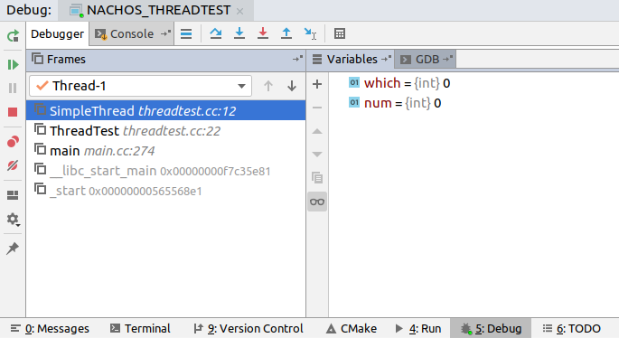

## Remember, always check your compilation results with the original Makefiles!
# USE AT YOUR OWN RISK!

## (Update) How to Compile Test Programs on Your Own Computer

- Use a file transfer software (such as [FileZilla](https://filezilla-project.org/)) to login the remote server. Make sure that the protocol is sftp, that is, the URL should be something like ```sftp://lcs-vc-cis486.syr.edu```
- On the remote server, navigate to ```/usr/local/nachos```, download the entire folder to your local computer
- Copy the ```nachos``` folder into your ```/usr/local/``` folder (this has to be done with command line because it needs high privilege)
- Change the ownership of the files, for example, you can use ```sudo chown -R <NAME OF YOUR ACCOUNT>:<NAME OF YOUR ACCOUNT> /usr/local/nachos ```
- You can now open the folder in GUI, with the command ```xdg-open /usr/local/nachos```. The GUI allows us to modify file permission with ease, just right click the files (one can select multiple files) and select "Properties" in the context menu. Tick "Allow executing file as program" in the "Permissions" tab.
-  Add execute permission for the files without extension (i.e. excitable files) in:
  - ```/usr/local/nachos/bin```
  - ```/usr/local/nachos/decstation-ultrix/bin```
  - ```/usr/local/nachos/lib/gcc-lib/decstation-ultrix/2.95.2```

- Now you should be able to cross compile MIPS programs on your local computer! Enjoy!

## What is this repo?

It is essentially the original NachOS files (with some small modifications, which are listed below) provided on Blackboard, plus a ```CMakeLists.txt``` - a CMake configuration for NachOS.

## Why CMake?

Because CMake is a cross-platform building tool. More importantly, a very powerful IDE - JetBrains CLion, works perfectly with CMake. It is completely for free for college students (one only needs to register with their university email), and it is available on almost all platforms: Windows, OS X, Linux... you name it. With the help of IDE, we can write and debug code much more efficiently.

- To import this project into CLion: open the code folder with CLion. (Although one can also open the root folder, he/she may need to manually open ```CMakeLists.txt``` and load CMake project in CLion. It will take a longer time for CLion to figure out what the project structure is.)

- To run NachOS without any parameter: simply press the play button at the top right corner of CLion


- In order to run with parameters, we can setup a run config in CLion


- We can set a breakpoint and debug just like in other IDEs (e.g. MSVC)!



## Test on different OS'


- [x] i686-pc-cygwin-g++ (GCC) 6.4.0
  In order to compile on Windows, **please install 64-bit Cygwin!**  64-bit Cygwin and 32-bit Cygwin are different bundles and they can coexist on one system.

  In order to keep the size of Cygwin small, I find out that only these packages are required:

  - gdb
  - make
  - cmake
  - cygwin32
  - cygwin32-gcc-g++
  - cygwin32-gcc-core

	Make sure your PATH environment variable contains the following records (modify them according to your Cygwin install location):
	- ```D:\cygwin64\bin```
	- ```D:\cygwin64\usr\i686-pc-cygwin\sys-root\usr\bin```
Remember to restart CLion after resetting environment variables.

In CLion, double check that your compiler configuration looks like this:


Luckily, I succesfully compile NachOS on Windows. (Take a look at the ugly command prompt of windows!)


However, this solution on Windows is not perfect:
1. CLion seems to work poorly with Cygwin (it works pretty well with MinGW though). Although I can compile the program and run it via Windows Explorer, I cannot run the program properly inside CLion.
2. The gdb bundled by Cygwin seems to be malfunctioning. 

Nonetheless, we can finally work on Windows locally. Remember that if your program crashes in CLion, always run it from Windows Explorer to see what the problem is. Usually it is a missing DLL problem.
- [x] g++ (Ubuntu 5.4.0-6ubuntu1~16.04.11) 5.4.0 20160609

**Passed compilation on the remote machine**
- [x] g++ (Ubuntu 7.3.0-27ubuntu1~18.04) 7.3.0
- [ ] g++ Apple LLVM version 10.0.0 (clang-1000.10.44.4)

**(Failed)** Due to the fact that Apple no longer provides i386 support, I cannot compile NachOS on my Mac. It is nontrivial to adapt NachOS for 64-bit mode. I am afraid that I might make some mistakes, so I am not doing it for you guys.

If someone's Apple compiler still supports 32-bit mode, please inform me of the compilation results.

## Some slight modifications
- Removed ```#include "synchlist.h"``` in ```~/threads/synchlist.cc```
- Changed the filename of ```~/userprog/errno.h``` into ```errno_nachos.h``` because it conflicts with the header in C standard library. Note that this file is not included in any project source files so far.

So far, they do not seem to cause a problem when compiling with the original Makefiles.

## If you like my work, please star the repo. Thank you very much!
